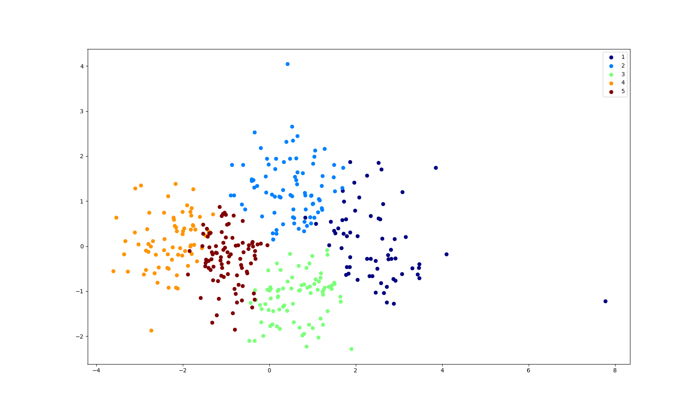
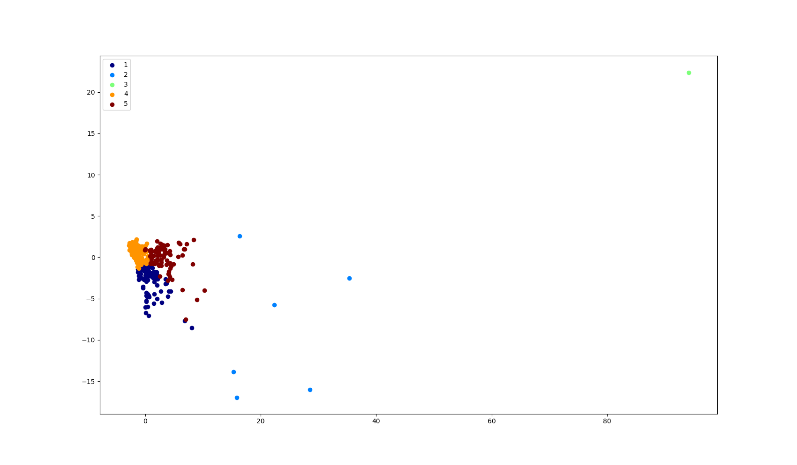
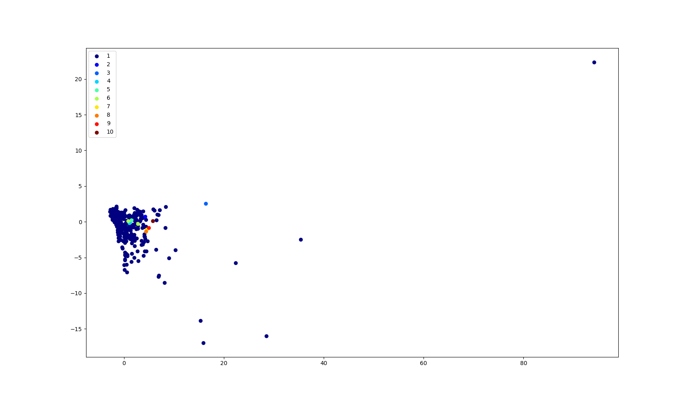
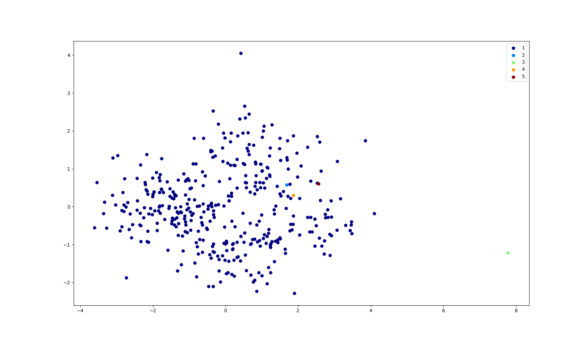
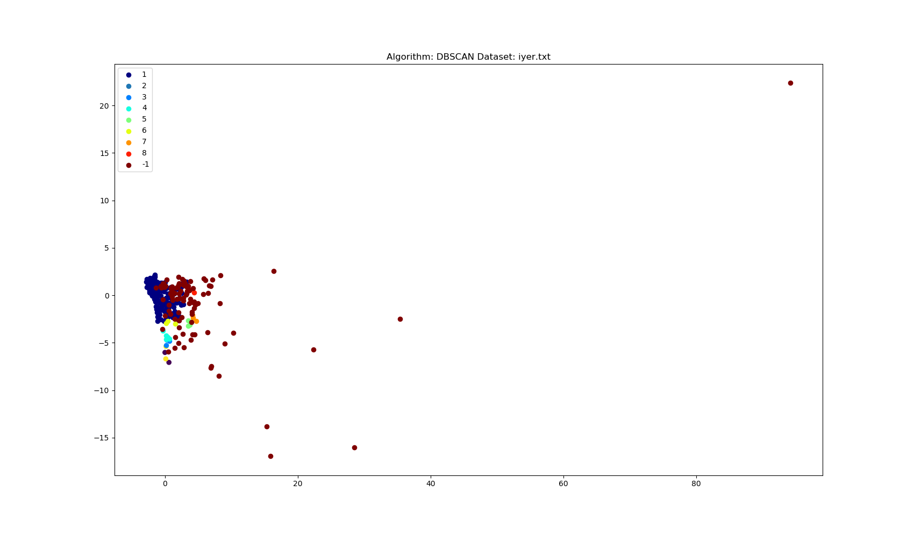
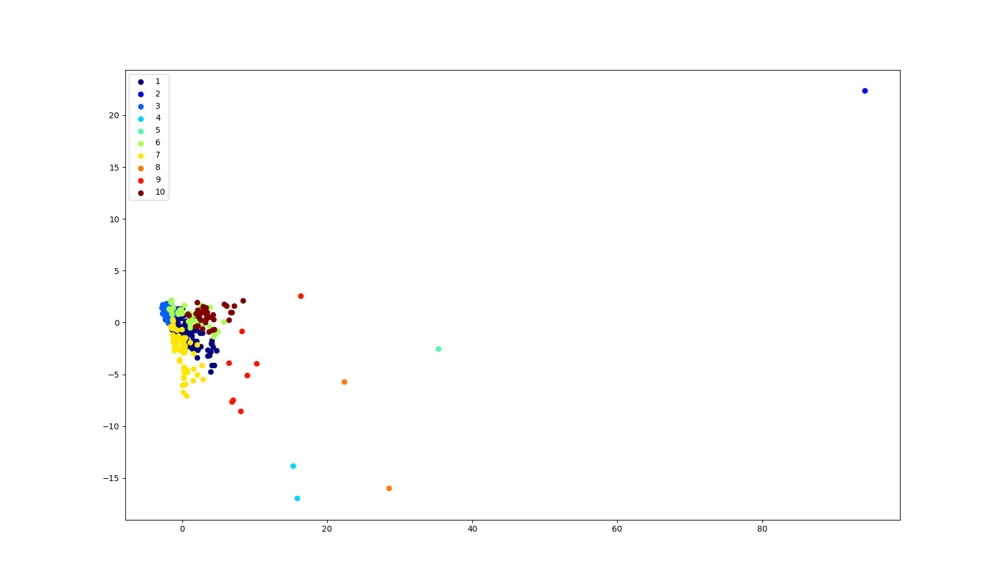
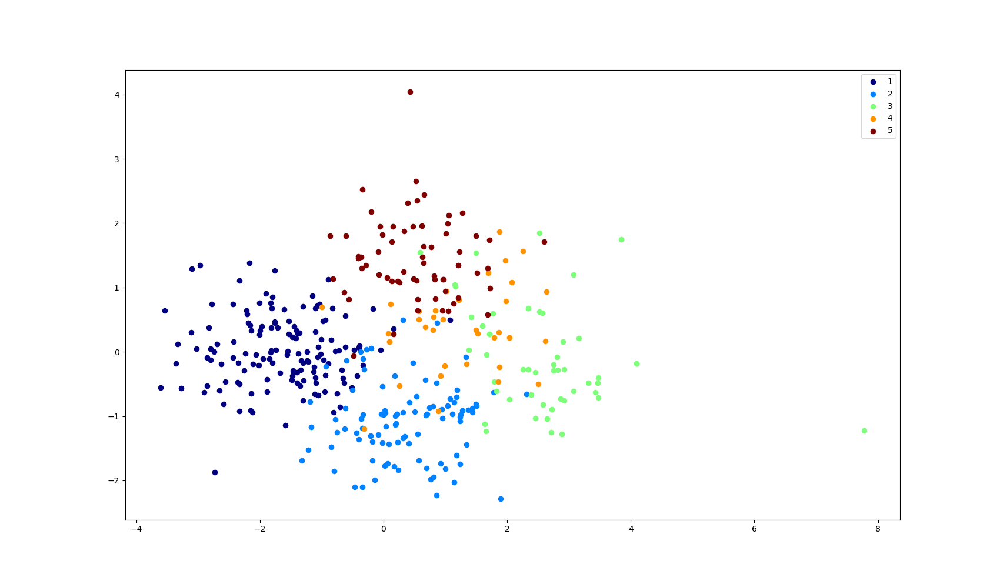

# CSE 601 - Project 2: Clustering Algorithms

# Team members:

**Arvind Thirumurugan** - **athirumu**

**Saketh Varma Pericherla** - **sakethva**

**Vijay Jagannathan** - **vijayjag**

# K-means:

## Algorithm Description:

- K-means is a clustering algorithm which partitions ‘n’ data points into ‘k’ clusters.
- The cluster for each data point is chosen in such a way that the data point is closer to the center of a cluster, than to the center of any other cluster. This center is called the centroid.
- The number of clusters or ‘k’ is usually specified.
- The initial centroids are also specified or can be random values.

### **Cluster Initialization**

- The number of clusters or ‘k’ is predefined(input) so that the ‘n’ data points can be partitioned.
- The initial cluster centers or centroids are also defined(input) or can be random values.
- The function get_initial_clusters() generates random clusters if the clusters are not specified in the input.
- The number of iterations is also given as an input parameter.

### **Cluster Assignment**

- Now, for each data point, we compute the euclidean distance from the data point to the different centroids.
- We assign the cluster whose centroid is closest to the data point.
- The function kmeans() computes this euclidean distance for all the data points from the cluster centers and also assigns the data points to the corresponding clusters. This function also calls new_centroids() to compute the new centroids until convergence.

### **Centroid Updation**

- Once all the data points have been assigned to a particular cluster, we compute the mean of the data points from each cluster.
- This serves as the new centroid or cluster center.
- Now, we have to repeat Cluster assignment until the old and new centroids are the same. This is when we achieve convergence.
- The function new_centroids() computes the mean of the data points in a particular cluster and calls kmeans() if there is no convergence.

## Result Visualization:

### **cho.txt**

Number of clusters: 5

Maximum iterations: 20

Cluster Centers: [ 27, 362, 131, 66, 36]

Jaccard Value: 0.40784657011

Rand Index Value: 0.800236247953



### **iyer.txt**

Number of clusters: 5

Maximum iterations: 20

Cluster Centers: [ 319, 498, 49, 166, 362]

Jaccard Value: 0.276806304995

Rand Index Value: 0.637471051933



## Result Evaluation:

### Advantages:

- Easy to implement
- Guarantees convergence
- Scales well to large datasets as well

### Disadvantages:

- Need to specify the number of clusters(k)
- Empty clusters may appear
- Kmeans does not work well with differing sizes, densities and irregular shapes

# Hierarchical Agglomerative clustering with Min approach:

- In the Agglomerative approach, we start from the bottom where the objects are merged at each step and propagated upwards as clusters.
- The algorithm begins with each individual object and merges the two closest objects. The distance between two clusters is calculated using the Euclidean distance.
- The process is iterated until all objects are aggregated into a single group.

## Algorithm Description:

1. Convert the features of the object into a distance matrix.
2. Set each object as a cluster.
3. Iterate until the number of clusters become one.
4. Merge two closest clusters.
5. Update the distance matrix then go to step 3.

## Implementation:

1. The first step involves feeding the dataset to getDistMatrix() function which calculates the distance matrix required for hierarchical clustering.
2. Initially the Distance matrix will be of size n\*n where n denotes the total number of objects in the dataset.
3. Then at each iteration till we reach the number of clusters desired we run the algorithm merging two of the closest clusters at each iteration and then updating the Distance matrix accordingly.
4. Calculate the Jaccard and Rand Coefficients to identify the performance of the algorithm using the predicted and ground-truth values

## Result Visualization:

### **iyer.txt:**

Rand Index: 0.1882868355974245

Jaccard index is: 0.15824309696642858



### **cho.txt:**

Rand: 0.24027490670890495

Jaccard: 0.22839497757358454



## Result Evaluation:

- Its space Complexity is O(N^2) since we are using a distance matrix. Its time complexity is O(N^3) in most cases since we need delete certain rows and columns for N iterations and we search the matrix for the minimum distance which takes O(N^2). It can be optimized to O(N^2LogN) for some cases.

- From the results observed performance seems to be poor when compared to other algorithms such as K-means or GMM since there is no objective function that is minimized.

### Advantages:

- Can handle non-elliptical shapes
- Any number of desired clusters can be obtained

### Disadvantages:

- No objective function to directly minimize
- Once a cluster is formed it cannot be undone
- Sensitive to noise and outliers

# DBSCAN:

- Density Based Spacial Clustering of Applications with Noise or DBSCAN is a clustering algorithm that seperates data points based on the density of the region they belong to.
- Clusters are defined as dense regions in the data space, separated from regions of lower density.
- The size of the region is defined by the &#949;-Neighborhood which gives the region within a radius of &#949; from a data point.
- Before jumping into the algorithm, some of the key concepts are described below:
- **Core point** - A point is a core point if it has more than a specified number of points (MinPts) within Eps—These are points that are at the interior of a cluster.
- **Border point** - A border point has fewer than MinPts within Eps, but is in the neighborhood of a core point.
- **Noise point** - A noise point is any point that is not a core point nor a border point.
- **Directly density-reachable** - An object q is directly density-reachable from object p if p is a core object and q is in p’s &#949;-neighborhood.

## Algorithm:

For each point in the dataset that is not yet classified do the following steps:

- Check if the point is a core point or not.
- If the point is not a core point label it as a noise point
- If the point is indeed a core point, collect all the points that are density reachable from the current point and label them as a new cluster
- Repeat the above steps until all the points are visited and labeled into a cluser or as noise.

## Implementation:

1. The parameters &#949; and MinPts are specified when running the program. We choose a small epsilon value typically between 0.5 to 1.5 and MinPts value as 3 for optimal results.
2. Using the 'regionQuery' function find the neighbors of the point using &#949; and MinPts and euclidean distance, for each unvisited point in the matrix.

3. If the number of neighbors is more than the minimum number of points, classify the point to the corresponding cluster id.
4. If the number of neighbors is less than the minimum number of points, classify the label of that
   point to be -1.
5. The 'expandCluster' function is used to assign every unvisited point
   in the neighborhood of point to the same cluster id. The point's neighbors are calculated by 'regionQuery' and then added on to the existing neighboring points.

## Result Visualization:

### **iyer.txt:**

Epsilon: 1.3

MinPts: 3

Rand index: 0.6526755683922646

Jaccard index: 0.2835567491646023



### **cho.txt:**

Epsilon: 1

MinPts: 3

Rand index: 0.5664715831297484

Jaccard index: 0.2037425112793077


## Result Evaluation:

- The time complexity of this algorithm is O(n<sup>2</sup>), so it is reasonably fast when compared to algorithms like HAC and Spectral Clustering.
- If dataset is too large small clusters are likely to be labeled as noise
- If dataset is too small, even a small number of closely spaced that are noise or outliers will be incorrectly labeled as clusters.
- DBSCAN performs exceptionally well on datasets having well seperated dense regions of arbitrary shapes and sizes as demonstrated by the high jaccard value for the demo dataset while it performed poorly with iyer and cho datasets as a fixed epsilon value cannot account for the sparseness and disparity in distribution of the former two datasets.

### **Advantages:**

- DBSCAN can find arbitrarily sized and shaped clusters.
- We don’t need to specify the number of clusters, as opposed to k-means.
- DBSCAN is resistant to outliers, as opposed to k-means.

### **Disadvantages:**

- DBSCAN cannot perform well with data spread across varying densities since &#949; and MinPts are provided as constants for the entire dataset.
- DBSCAN is not completely deterministic. Depending on the order of processing the data, border points reachable from more than one
  cluster can be part of different clusters across multiple runs of the same algorithm.

# Guassian Mixture Model:

- A mixture model is an probabilistic unsupervised model for clustering applications.
- In a Guassian Mixture model we use multiple Probability Density Functions to model the data into clusters.
- Unlike other clustering algorithms which do hard clustering where every point belongs to exactly one cluster, GMM performs soft clustering where every point belongs to several clusters with certain degrees.
- We use Expectation Maximization framework to train the model using GMM.

## Implementation:

1. While running the program we specify number of clusters which is a required parameter and optional parameters like the initial mean, covariance, pi, convergenece threshold, maximum iterations and smoothing value as input to the program.
2. **Expectation:** For the given parameter values we predict the values of the latent variables. We use sklearn's multivariate_normal.logpdf function to calculate the probability distribution function to be multiplied with the probability parameter pi to obtain a prediction for each cluster. Below code snippet shows the impementation:
   ```python
       for j in range(N):
           for k in range(self.num_clusters):
               pdf = multivariate_normal.pdf(
                   self.X[j], mean=mu[:, k], cov=sigma[k])
               self.predicted[j, k] = pi[k] * pdf
           self.predicted[j] /= np.sum(self.predicted[j])
   ```
3. **Maximization:** The objective is to maximize the log likelihood function. We use the smoothing value to avoid singular matrix errors and use the multivariate_normal.logpdf function available in sklearn package to determine the log likelihood value. We then update the mean and covariance with the newly obtained values. Below snippet shows the steps involved in maximization:

   ```python
       def log_likelihood(self, mu, sigma, pi):
          ...
           for n in range(N):
               for k in range(self.num_clusters):
                   np.fill_diagonal(
                       sigma[k], sigma[k].diagonal()+self.smoothing_value)
                   loss += self.predicted[n, k]*math.log(pi[k])
                   loss += self.predicted[n, k] * \
                       multivariate_normal.logpdf(
                           self.X[n], mean=mu[:, k], cov=sigma[k])
           return loss
       ...
       curr_likelihood = self.log_likelihood(mu, sigma, pi)

       pred_sum = np.sum(self.predicted, axis=0)
       pi = pred_sum / N
       mu = np.dot(self.X.T, self.predicted) / pred_sum
       sigma = np.zeros((self.num_clusters, M, M))
       ...
   ```

## Result Visualization:

### **iyer.txt**

Mean, covariance: Initialized using labels from K-means
Number of clusters: 10
Smoothing threshold: 5\*10<sup>-8</sup>

Rand index: 0.7618083796938894

Jaccard index: 0.3529943801384132



### **cho.txt**

Mean, covariance: Initialized using labels from K-means
Number of clusters: 5
Smoothing threshold: 10<sup>-15</sup>

Rand index: 0.7959005610888883

Jaccard index: 0.4018254061922184



## Result Evaluation:

- GMM has provided more accurate results than density based given that it is initialized by K-means and the fact that it uses probabilistic assignments instead of hard assignments based on near neighbor density.
- Though density based clustering is not accurate for sparsely seperated cho dataset and disparity in distribution of points in iyer dataset, GMM is able to provide more accuracy leveraging multiple Guassians and probabilistic assignments.

### Advantages:

- GMM can handle clusters with varying sizes and variance
- GMM gives probabilistic cluster assignments so that soft clustering can be performed for more accurate decision making. In contrast, density based clustering can wrongly assign border points.

### Disadvantages:

- Initialization is crucial for generating accurate clusters using GMM. Other clustering algorithms like K-means are used to initialize the mean and covariance before running GMM.
- GMM has overfitting problems where the algorithm tries to fit the data points perfectly and ends up performing poorly on new data.

# Spectral Clustering:

## Algorithm Description:

## Result Visualization:

## Result Evaluation:
